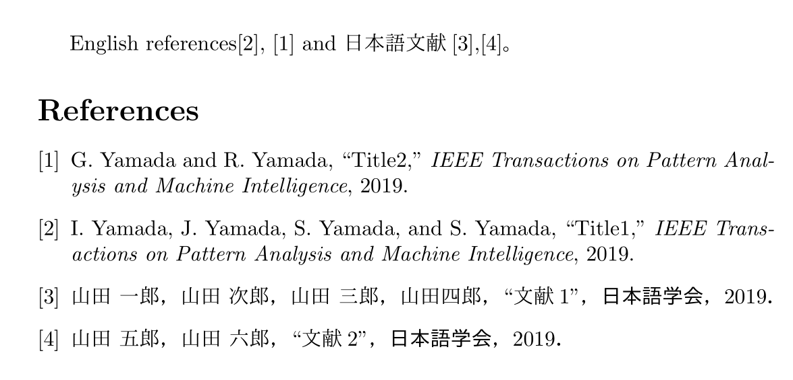

# bibtex style (.bst) file for English and Japanese users
bibtexで使えるIEEEtranの引用形式を保ったまま，日本語と英語の双方に対応できるように変更を加えたbstファイルです。

- IEEEtran_withJP：通常のIEEEtranの2言語版
- IEEEtranS_withJP：著者のアルファベット順で並び替えたIEEEtranSの2言語版
- ieeetr_withJP：調整中

# 使い方（IEEEtranS_withJPの例）

`IEEEtranS_withJP.bst`というファイルをPathの通った箇所かtexファイルと同じフォルダに入れて，以下のように文章内で記述します。（`ref.bib`は自分で作ったbibファイルを参照するように。）

```tex
\bibliographystyle{IEEEtranS_withJP}
\bibliography{ref.bib}
```

## サンプルTexファイル
サンプルのファイルがtestフォルダ以下にあります。

もとにするbibファイルは以下のように `isjapanese = {true}`という行を追加しています。


```bib
@article{japaneseTest1,
 author = {山田 一郎 and 山田 次郎 and 山田 三郎 and 山田 四郎},
 year = {2019},
 journal = {日本語学会},
 title = {文献1},
 isjapanese = {true}
}
@article{japaneseTest2,
 author = {山田 五郎 and 山田 六郎},
 year = {2019},
 journal = {日本語学会},
 title = {文献2},
 isjapanese = {true}
}
@article{englishTest1,
 author = {Ichiro Yamada and Jiro Yamada and Saburo Yamada and Shiro Yamada},
 year = {2019},
 journal = {IEEE Transactions on Pattern Analysis and Machine Intelligence},
 title = {Title1}
}
@article{englishTest2,
 author = {Goro Yamada and Rokuro Yamada},
 year = {2019},
 journal = {IEEE Transactions on Pattern Analysis and Machine Intelligence},
 title = {Title2}
}
```


出力されるtexはこんな感じになります。



## bib fileの自動編集
`isjapanese = {true}`のフラグを自動でたてるpythonプログラムを`bibFileGenerator_python`直下に作成しました。

大まかには2バイト文字の混ざっている参考文献に上記のフラグを追記するという動作をします。

使い方は

```
python addJPflag.py *.bib
```

で`*_withJP/bib`というファイルが生成されます。


# 変更箇所・参考文献
[参考文献](https://qiita.com/HexagramNM/items/3ad757a9f5ee5d15e363#_reference-2be0cc9a71381591bb17)の記述をもとに[元ファイルIEEEtranS.bst](http://tug.ctan.org/tex-archive/macros/latex/contrib/IEEEtran/bibtex/IEEEtranS.bst)を変更しました。
この場を借りてお礼申し上げます。

詳しい説明などは[当該Qiita記事](https://qiita.com/ossyaritoori/items/7574ab2f3f9b9e8e1836)で随時変更します。

## 日本語のみフルネーム表記へと変更する下準備
- 処理内容

`FUNCTION {default.name.format.string}{ "{f.~}{vv~}{ll}{, jj}" }`のしたに，日本語用の表記を追記します。

```
% The default name format control string. %change based on japanese
FUNCTION {default.name.format.string}{ "{f.~}{vv~}{ll}{, jj}" }
FUNCTION {default.name.format.string.forJP}{ "{ff~}{vv~}{ll}{, jj}" } %%追加箇所
```

- 意図解説

`FUNCTION {default.name.format.string}{ "{f.~}{vv~}{ll}{, jj}" }`のうち，`{f.~}`がデフォルトの名前の表記を名字1文字+カンマに設定しています。これを以下のように`{ff~}`と変更すれば，名字をフルネームで書けるようになります。
（2020/1/12追記）なお`{ff ~}`としないと名字と名前の間をうまく開けてくれないことがあるらしいです。
`FUNCTION {default.name.format.string}{ "{ff ~}{vv~}{ll}{, jj}" } }`


しかし，これはデフォルトの設定を変えてしまうので英語のフォーマットを崩してしまいます。後の行を見ると実はinitializeの過程で`name.format.string`にこれを代入しているに過ぎません。ということで，後に追加する`japanese.flag`に応じてこれを変更するように書けばよいわけです。

- `name.format.string`への代入箇所

```bst
FUNCTION {initialize.controls}
{ default.is.use.number.for.article 'is.use.number.for.article :=
  default.is.use.paper 'is.use.paper :=
  default.is.use.url 'is.use.url :=
  default.is.forced.et.al 'is.forced.et.al :=
  default.max.num.names.before.forced.et.al 'max.num.names.before.forced.et.al :=
  default.num.names.shown.with.forced.et.al 'num.names.shown.with.forced.et.al :=
  default.is.use.alt.interword.spacing 'is.use.alt.interword.spacing :=
  default.is.dash.repeated.names 'is.dash.repeated.names :=
  default.ALTinterwordstretchfactor 'ALTinterwordstretchfactor :=
  default.name.format.string 'name.format.string := %%ここで代入されている
  default.name.latex.cmd 'name.latex.cmd :=
  default.name.url.prefix 'name.url.prefix :=
}
```


## フラグの追加

- bibファイルにisjapaneseフラグを追加。
- bstファイル内でフラグを管理するInteger`japanese.flag`に関する記述を追加。


## 日本語文献のカンマやピリオドの全角化，"の後にカンマが来るように変更
`FUNCTION {output.nonnull}`と` FUNCTION {fin.entry}`を変更。


## 日本語文献の複数著者の場合に出てきてしまうandの抑制
`FUNCTION{format.names}`の変更。

## start.entry及びfin.entryに日本語フラグを管理する処理を追加
bibにisjapaneseが{true}で入っていた場合に`japanese.flag`を立てる処理をします。
また，先程述べた日本語と英語での書式の変更もここでやってしまいます。


- `start.entry`内にて`isjapanese`を探して`japanese.flag`を立てる。
- flagが1の時，日本語用の名前フォーマット`default.name.format.string.forJP`へと`name.format.string`を切り替える。
- 最後に`fin.entry`内で`japanese.flag`を0に戻して，名前のフォーマットを英語用に戻す。

## 目標

オプションを指定することなく、
・電気学会形式で引用するbstファイル
・日本語は電気学会形式、英語はIEEEtran形式で引用するbstファイル
・全てIEEEtran形式で引用するbstファイル(もともとのままの出力)
を作成する。コード上部で指定するオプションだけ変更されいて、コード本体部分が同一だと管理が楽。

なお、電気学会のフォーマットは[電気学会論文誌への投稿手引詳細 5.5 文献](https://www.iee.jp/pub/contribution_guide/detail/#2-5-5)に指定されている通り。ただし、このページでは日本語文献末尾の発行年両端カッコは半角だが、公開されているLaTeXスタイルに内包されるサンプルPDFでは全角カッコとなっており、表記ユレがある。


> 1.	日本語論文などの場合  
> T. Denki, M. Hanai, and G. Misaki: “Future Technology for Power System Analysis”, IEEJ Trans.PE, Vol.130, No.1, pp.130-136 (2010) (in Japanese)  
> 電気太郎・花井桃子・岬 五郎：「電力系統解析技術の将来」，電学論B，Vol.130, No.1, pp.130-136(2010)
>
> 1.	国際会議などの論文集の場合  
> B. Yamada: “Experimental studies of new micromechanical vibration systems”, Proc. IEEE Conf. on Micro-mechanical Component, No.21, pp.123-145, Paris, France (1999)
>
> 1.	単行本などの場合  
>Y. Sankar: Management of Technological Change, p.10, John Wiley, New York (1991)
>
> 注：日本語単行本の表記は，上記(a)のような取り扱いとする。
